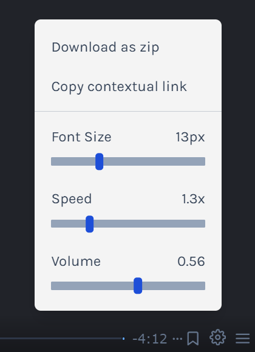

# [JSL09] Submission: Personal Dashboard Chrome Extension

Scrimba Reference Link: https://scrimba.com/learn/frontend/promise-rejection-coc4a4e4d8d208ab33b190dd5

## What You Need to Do:

1. Clone the provided Starter Code Repository to your local development environment (e.g., VSCode): https://github.com/CodeSpace-Academy/Module_09_StudentNo_Classcode_Group_Name-Surname_JSL09
2. Open the cloned project in your code editor.
3. Code your solution for the challenge as per the provided instructions.
4. If you have coded your Personal Dashboard challenge in Scrimba, you will need to download the zip folder of your project files. Unzip the project files into your JSL09 project repo on GitHub. Make sure to NOT use the Scrimba README. Instead you will keep your starter code README.
5. Commit your changes to your local Git repository with meaningful commit messages.
6. Push your local Git repository to your GitHub account.
7. Verify that the changes have been successfully pushed to your GitHub repository.

You can download your Scrimba files in the bottom right hand corner of the Scrimba IDE panel. 

## What You Need to Include:

1. Ensure that your code includes the necessary modifications to meet the challenge requirements.
2. Your GitHub repository should contain the updated code files.

# Project Overview
The Promise Rejection Dashboard Challenge is an interactive web-based project focusing on creating a Chrome Dashboard extension. This was a Scrimba project that I had to upload to the Module 09 GitHub repo.

# Project Brief
In this project I had to follow along with the Scrimba Promise Rejection capstone to create a Personal Dashboard for a Chrome Browser. 

# Elements included 
- Ensure that your code includes the necessary modifications to meet the challenge requirements.
- Your GitHub repository should contain the updated code files:
    - index.html
    - style.css
    - script.js
    - manifest.json file

# Reflections 

### Areas of mastery 
-APIs
Although I feel as though I have not been exposed to all the aspects of APIs and how they function, I believe that I have a good understanding of the elements that I have been exposed to and I'm able to access and read that data that is in an API and understand how they work and how they can be used. 

-.catch() and .throw() 
These methods are very useful when it comes to handling errors in JavaScript, and I am actually looking forward to utilizing them in my future projects. I feel as though they are also an area of mastery because I understand their function and how they can be implemented in code for a more efficient coding experience.

-fetch() and .then() syntax
These methods are also very useful and learning about different ways to access data from an API has been a great but enriching learning curve for my coding journey. I believe this new skill will elevate my future projects.

### Challenges faced 
I faced a few challenges regarding the APIs when I was coding along with the Scrimba videos due to network issues and being unable to access the data that I needed. I was able to resolve this however, and only then had a greater understanding and easier experience with the project. Another challenge I faced (which I eventually conquered), was the syntax for the API fetch() and .then() methods. Having the Scrimba videos helped reduce the learning curve but initially trying to solve the problem on my own was a challenge. 

### Areas of Improvement 
I would like to improve my understanding of Asynchronous programming, specifically the logic and concept behind writing code that has a "delay" element to it (in a JS context, which runs code in a linear fashion). 

## Overall learning experience
My overall learning experience was very positive. Having Scrimba videos to code along to was a refreshing change of pace in this Javascript course. I was able to grasp concepts easier and quicker, not sure if it was the topic or method of delivery but somehow I understood the required solutions better than the previous projects. 

